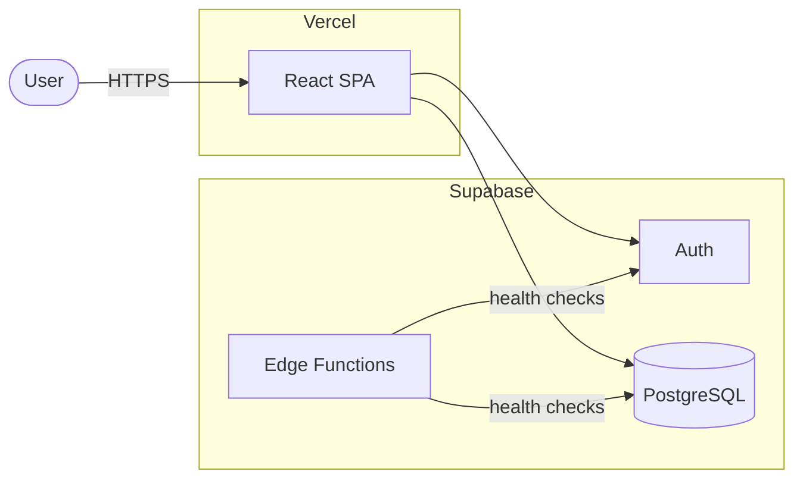
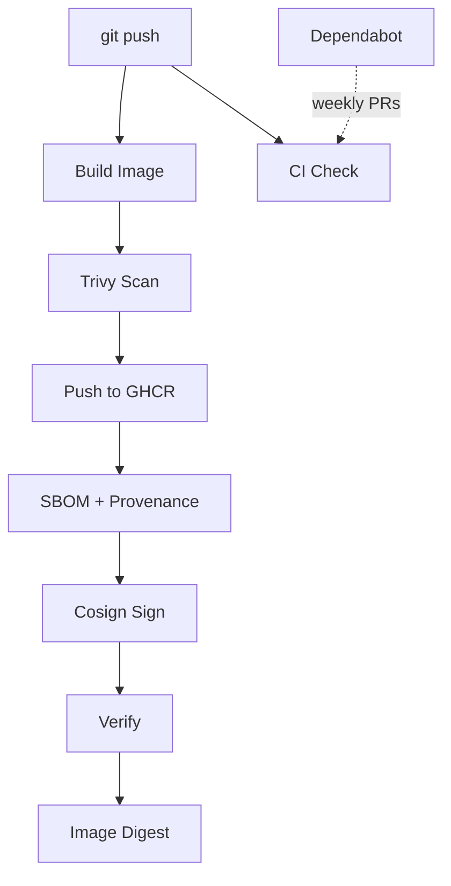

# ☸️ KubeQuest

**A Kubernetes learning and interview practice game for DevOps engineers.**

Practice real-world Kubernetes scenarios, sharpen your troubleshooting skills, and prepare for CKA-level interviews — through interactive quizzes, incident simulations, and daily challenges.

[](https://www.kubequest.online/)
[](LICENSE)
[](https://github.com/or-carmeli/KubeQuest/actions/workflows/ci.yml)
[](https://github.com/or-carmeli/KubeQuest/actions/workflows/security.yml)
[](https://react.dev)
[](https://vitejs.dev)
[](https://supabase.com)
[](https://github.com/or-carmeli/KubeQuest/pkgs/container/kubequest)

---

## Live Demo

[kubequest.online](https://www.kubequest.online/) — no registration required, works instantly in guest mode.

---

## Demo


## Screenshots


---

## How It Works

1. **Pick a topic** — Workloads, Networking, Config & Security, Storage & Helm, or Troubleshooting
2. **Choose a difficulty** — Easy, Medium, or Hard (levels unlock as you progress)
3. **Answer questions** — multiple choice with instant feedback and detailed explanations
4. **Practice incidents** — step through multi-step real-world failure scenarios (CrashLoopBackOff, ImagePullBackOff, misconfigured NetworkPolicy, and more)
5. **Track your progress** — score, accuracy, streaks, weak areas, and achievements

---

## Features

- **🚨 Incident Mode** — multi-step Kubernetes failure scenarios with step-by-step diagnosis and scoring
- **🧠 Topic Quizzes** — 5 topics × 3 difficulty levels, progressively unlocked
- **🔥 Daily Challenge** — 5 fresh questions every day
- **🎲 Mixed Quiz** — random questions across all topics
- **🎯 Interview Mode** — mandatory timer, hints disabled, exam pressure
- **📖 Kubernetes Guide** — built-in cheatsheet for quick lookup while practicing
- **🗺️ Roadmap View** — visual learning path through all topics and levels
- **📉 Weak Area Card** — surfaces your lowest-accuracy topic automatically
- **↩️ Quiz Resume** — continue where you left off after refresh or navigation
- **🏆 Leaderboard** — global top scores
- **🏅 Achievements** — milestone-based reward system
- **🌐 Hebrew / English** — full bilingual support with RTL layout
- **👤 Guest Mode** — no account needed; sign up to sync progress across devices
- **📊 Real-Time Monitoring** — live system status page with service health checks, uptime history, and incident tracking ([docs](docs/monitoring.md))

---

## Tech Stack

| Layer | Technology |
|-------|-----------|
| Frontend | [React 18](https://react.dev) + [Vite 5](https://vitejs.dev) |
| Auth & Database | [Supabase](https://supabase.com) (PostgreSQL + Auth) |
| Deployment | Vercel |

---

## Architecture

### Runtime



### CI/CD Pipeline



> **Production** runs on Vercel + Supabase. The `k8s/` manifests and Docker image on GHCR enable self-hosting on any Kubernetes cluster.

---

## Local Development

### Prerequisites

- Node.js 18+
- A free [Supabase](https://supabase.com) account _(optional — guest mode works without it)_

### Setup

```bash
git clone https://github.com/or-carmeli/KubeQuest.git
cd KubeQuest
npm install
cp .env.example .env   # add your Supabase credentials
npm run dev            # → http://localhost:5173
```

### Environment Variables

```env
VITE_SUPABASE_URL=https://your-project-id.supabase.co
VITE_SUPABASE_ANON_KEY=your_supabase_anon_key_here
```

> Auth, leaderboard, and cross-device sync require a Supabase project. All other features work without credentials.

### Available Scripts

```bash
npm run dev      # development server
npm run build    # production build
npm run preview  # preview production build locally
```

### Docker

KubeQuest is a **Single Page Application (SPA)** — React handles all navigation client-side from a single `index.html` file. The web server must serve `index.html` for every URL so React can take over routing.

The Dockerfile uses a **multi-stage build** to keep the production image small and clean:

```
Stage 1 — Builder  (node:20-alpine)
  npm ci              → install dependencies
  npm run build       → compile React source → static HTML/CSS/JS in /dist

Stage 2 — Runner   (nginx:alpine)
  copies /dist        → only the built output (no Node.js, no source code)
  serves via nginx    → fast, lightweight web server with SPA routing
```

Final image size: ~25MB (vs ~500MB if Node.js were included).

```bash
docker build -t kubequest .
docker run -p 8080:80 kubequest
# → http://localhost:8080
```

---

## Supabase Setup

Create a `user_stats` table:

| Column | Type |
|--------|------|
| `user_id` | `uuid` — unique, references `auth.users` |
| `username` | `text` |
| `total_answered` | `int4` |
| `total_correct` | `int4` |
| `total_score` | `int4` |
| `max_streak` | `int4` |
| `current_streak` | `int4` |
| `completed_topics` | `jsonb` |
| `achievements` | `jsonb` |
| `topic_stats` | `jsonb` |
| `updated_at` | `timestamptz` |

Enable Row Level Security:

```sql
create policy "Users can manage own stats"
on public.user_stats
for all
to public
using (auth.uid() = user_id);
```

---

## Kubernetes Deployment

The `k8s/` directory contains production-ready manifests to deploy KubeQuest on any Kubernetes cluster.

```
k8s/
  namespace.yaml    # Isolated namespace: kubequest
  deployment.yaml   # 2 replicas, resource limits, liveness & readiness probes
  service.yaml      # ClusterIP service (internal traffic only)
  ingress.yaml      # Nginx Ingress with TLS via cert-manager + HTTP→HTTPS redirect
  hpa.yaml          # HorizontalPodAutoscaler: scale 2→10 pods at 70% CPU
```

```bash
# Deploy to a cluster
kubectl apply -f k8s/
```

> Requires: nginx ingress controller + cert-manager installed in the cluster.

---

## CI/CD & Supply Chain Security

### Container Pipeline

Every push to `main` or a version tag (`v*.*.*`) triggers the [Docker Build & Push](.github/workflows/docker.yml) workflow:

```
Build image → Trivy scan → Push to GHCR → Attach SBOM & provenance → Sign with Cosign → Verify signature
```

The workflow uses concurrency control — rapid pushes to the same ref cancel older in-progress runs. On completion, the immutable image reference (`ghcr.io/or-carmeli/kubequest@sha256:...`) is printed for use in deployments.

### Image Tags

| Trigger | Tag | Example |
|---------|-----|---------|
| Push to `main` | `latest` + `sha-<commit>` | `latest`, `sha-a1b2c3d` |
| Git tag `v1.2.0` | Semver + `sha-<commit>` | `1.2.0`, `sha-a1b2c3d` |
| Manual dispatch | `sha-<commit>` | `sha-a1b2c3d` |

### Security Measures

- **Vulnerability scanning** — [Trivy](https://trivy.dev/) scans the image before push; the workflow fails on HIGH and CRITICAL vulnerabilities (unfixed CVEs excluded)
- **SBOM** — Software Bill of Materials attached to every published image
- **Provenance** — build provenance attestation (`mode=max`) provides cryptographic proof of build origin
- **Keyless signing** — [Cosign](https://docs.sigstore.dev/cosign/overview/) signs images by digest using GitHub OIDC; no secret keys to manage or rotate
- **In-pipeline verification** — the signature is verified in CI before the workflow completes

### Verify Locally

```bash
cosign verify \
  --certificate-oidc-issuer https://token.actions.githubusercontent.com \
  --certificate-identity-regexp "github\.com/or-carmeli/KubeQuest" \
  ghcr.io/or-carmeli/kubequest:latest
```

### Deploying by Digest

Every workflow run outputs an immutable image reference by digest. Use it in Kubernetes manifests, Helm values, or ArgoCD application specs to pin the exact image that was built, scanned, and signed:

```yaml
image: ghcr.io/or-carmeli/kubequest@sha256:<digest>
```

---

## Project Structure

```
src/
  App.jsx              # Main application (UI + state)
  api/
    quiz.js            # Quiz, daily, incident, leaderboard RPCs
    monitoring.js      # System status monitoring RPCs
  content/
    topics.js          # Quiz questions by topic and level
    incidents.js       # Incident Mode scenarios
    dailyQuestions.js  # Daily Challenge question pool
  components/
    RoadmapView.jsx
    WeakAreaCard.jsx
  utils/
    quizPersistence.js # localStorage helpers for quiz resume
supabase/
  migrations/          # Database schema and RPCs
  functions/
    health-check/      # Edge Function — real-time service health checks
docs/
  monitoring.md        # Monitoring system documentation
```

---

## Changelog

See [CHANGELOG.md](CHANGELOG.md) for the full release history.

---

## Contributing

Contributions are welcome — new questions, bug fixes, UI improvements.
See [CONTRIBUTING.md](CONTRIBUTING.md) for setup instructions and question format guidelines.

---

## License

[MIT](LICENSE) © 2026 Or Carmeli
